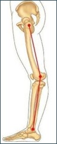
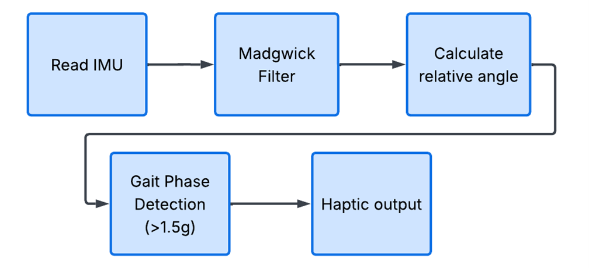
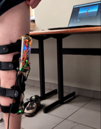
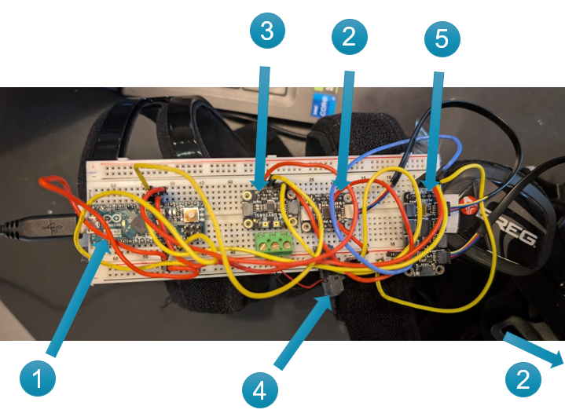
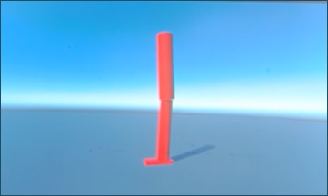

# Dual-IMU Haptic Monitor for Genu Recurvatum

## Introduction

### Clinical Challenge: Genu Recurvatum
Genu recurvatum, or knee hyperextension, is a highly relevant clinical problem affecting an estimated 40 to 68% of post-stroke patients with hemiparesis [1]. This phenomenon primarily occurs during the stance phase of walking and is highly harmful, requiring targeted clinical intervention for several reasons:
* **Tissue Damage:** It causes excessive strain on the ligaments and tendons at the back of the knee, which can lead to significant pain and chronic tissue damage, as well as accelerated degradation of knee cartilage components [2].
* **Gait Inefficiency:** It results in an inefficient gait; because the knee does not bend normally, the leg effectively becomes longer. This raises the body's center of gravity, disrupts symmetry, and leads to a much higher metabolic energy expenditure during ambulation.
* **Proprioceptive Loss:** Many stroke patients develop this abnormality because a loss of internal proprioception means they simply no longer physically feel when their knee joint reaches or exceeds the anatomical limit of 0 degrees [1].

### The Haptic Advantage
For this specific pathological challenge, haptic technology is ideally suited to act as an **external haptic sense**. Because the patient lacks the internal sensory warning that the knee is hyperextending, an external vibrotactile stimulus can directly substitute for this missing sensory feedback loop [4]. 

Unlike visual screens, which are highly distracting and dangerous during active walking, or audible alarms, which can be socially disruptive and difficult to perceive in noisy environments, haptic feedback provides a physical, intuitive, and discrete warning that directly prompts the patient to correct their movement in real time [6], [7].

### Limitations of Current Solutions
In standard clinical practice, primarily passive mechanical or invasive medical solutions are utilized, each possessing distinct drawbacks:
* **Rigid Orthoses:** Splints and knee orthoses, such as the *"Swedish knee cage"* or full rigid leg braces, physically block hyperextension [3]. However, they are bulky, uncomfortable, and notoriously difficult to don and doff for stroke patients who often have only one fully functional upper limb.
* **Invasive Interventions:** Botulinum toxin injections or surgical tendon lengthenings are sometimes applied, but these are highly invasive and primarily target severe spasticity rather than correcting underlying motor learning [1].
* **Audible Biofeedback:** Prior literature has experimented with kinematic biofeedback via electrogoniometers [4]. While effective at retraining gait, these systems are often cumbersome, rely on restrictive physical hinges placed directly across the joint line, and use disruptive acoustic beeps that lower user acceptance in social settings.

### Proposed Solution: The Dual-IMU Haptic Monitor
The **Dual-IMU Haptic Monitor** project offers an innovative, non-restrictive alternative to these traditional methods by leveraging smart, wearable sensor technology. By shifting from a mechanical constraint to an active biofeedback system, it introduces several key innovations:

1. **Hingeless Angle Tracking:** A physical hinge is no longer necessary. Instead of a rigid goniometer aligned with the joint, the system utilizes two independent MPU6050 IMU sensors mounted on the calf and thigh segments, calculating the relative knee angle electronically to maximize user comfort.
2. **Context-Aware Gait Phase Detection:** Genu recurvatum is exclusively dangerous when the lower limb is bearing the patient's body weight (the stance phase). The system features an algorithm that detects a **Heel Strike** via an acceleration threshold exceeding 1.5g. Consequently, haptic warnings are strictly context-aware, arming the vibration logic only during the stance phase when the joint is under active load.
3. **Advanced Sensor Fusion (4D Quaternions)**:To avoid gyroscopic drift and improve stability under dynamic movement, the architecture implements a Madgwick AHRS algorithm for each IMU, computing the absolute 3D orientation of each leg segment as a full quaternion. The relative knee angle is then extracted via a Gravity Inclination Method, which anchors both measurements independently to the gravity vector, yielding a stable and drift-resistant angle estimate during the stance phase.
4. **Hybrid Feedback Loop:** The disruptive audible alarm of previous setups is replaced by precise, proportional tactile vibration profiles delivered via high-fidelity *Drake Haptic Actuators* [6]. This data is simultaneously streamed via telemetry to a real-time **3D Digital Twin** in Unity. This creates a powerful dual-loop system: the patient receives physical (proprioceptive) guidance, while the physical therapist receives immediate visual (exteroceptive) confirmation of hyperextension and gait asymmetry for diagnostic mapping.

### Supplies (Bill of Materials)

To ensure full reproducibility of this prototype, the complete Bill of Materials is listed below. Where specific breakout boards were used (e.g., Adafruit), exact part numbers are provided.

| Component | Part Number / SKU | Qty | Estimated Cost | Purpose |
| :--- | :--- | :--- | :--- | :--- |
| **Arduino Micro** | A000053 | 1 | € 21.00 | Microcontroller for real-time control logic and sensor fusion |
| **MPU6050 6-DoF IMU** | GY-521 | 2 | € 6.00 | Inertial sensors for dynamic orientation and gait phase detection |
| **I2C Multiplexer** | Adafruit 2717 (PCA9548A) | 1 | € 8.00 | Resolves I2C address conflicts between the two identical MPU6050 sensors, enabling independent communication |
| **Haptic Motor Driver** | Adafruit 2305 (DRV2605L) | 1 | € 9.00 | I2C driver for generating complex haptic waveforms (LRA/ERM) |
| **Drake Haptic Actuator** | TH-D-952395-LFI | 1 | € 45.00 | High-fidelity vibrotactile feedback and impact clicks |
| **Breadboard** | Generic 800-tie | 1 | € 5.00 | Prototyping platform and central hardware integration |
| **STEMMA QT / Qwiic Cable**| Generic JST SH 4-pin | 2 | € 2.00 | Robust I2C communication wiring along the leg |
| **Jumper Wires** | Generic M/M & M/F | 1 | € 4.00 | System integration and breadboard routing |
| **Orthopedic Knee Brace** | BREG | 1 | / | Physical mounting frame for the sensors and haptic actuator |
| **Total Estimated Cost** | | | ~ € 100.00 | |

## Methods: Technical Approach & System Architecture

The conceptual framework of the Dual-IMU Haptic Monitor relies on creating a wearable, real-time biofeedback system that replaces the patient's impaired proprioceptive sense. By treating the leg as a two-part biomechanical hinge system (thigh and calf), the relative knee angle can be continuously calculated without the need to place an obstructive physical hinge across the joint.

### 1. Hardware Integration & I2C Routing
To ensure robustness during dynamic walking, the hardware is mounted on an external brace frame. The mainboard setup - consisting of the Arduino Micro, the DRV2605L haptic driver, and the primary MPU6050 IMU sensor - is securely attached to the thigh segment using Velcro straps. The second MPU6050 IMU sensor is fixed to the calf segment. This stabilization minimizes the structural influence of muscle contractions on the sensors and provides a stable platform for the wiring. Although the system uses a brace as a physical mounting frame, the angle measurement functions entirely electronically via the IMUs and requires no physical blockage or mechanical hinge components. The placement of these components on the physical prototype is illustrated below.

A significant hardware limitation when using multiple identical I2C sensors is the address conflict; by default, MPU6050 sensors share the exact same I2C address (0x68). In this design, this problem is elegantly solved by integrating the PCA9548A I2C multiplexer at address 0x70. Through a custom `tcaSelect(uint8_t i)` firmware function, this chip acts as a high-speed digital switch. By opening specific hardware channels sequentially, the microcontroller communicates targetedly at full speed (400kHz) with the upper thigh IMU on channel 3 and the lower calf IMU on channel 0. The DRV2605L haptic driver communicates directly on the I2C bus at address 0x5A, independently of the multiplexer.

The wiring for this configuration, with is shown below:

1. Arduino
2. 2x MPU6050 IMU
3. DRV2605L Haptic Driver
4. Drake Haptic Actuator
5. Multiplexer PCA9548A

  

### 2. Control Loop & Time Synchronization
Instead of utilizing an unpredictable and processor-blocking `delay()`, the main execution loop (`loop()`) utilizes a strict, non-blocking timer via the native `millis()` function. The software exclusively executes calculations, sensor sampling, and telemetry transmission when exactly 10 milliseconds have elapsed since the previous cycle, establishing a fixed execution loop frequency of **100Hz**. This rock-solid time base ($\Delta t$) is a strict mathematical requirement to maintain the stability of the numerical integration steps within the sensor fusion algorithm.

### 3. Advanced Sensor Fusion & Gravity Inclination Method

Accelerometers react extremely fast but are highly sensitive to high-frequency noise from walking vibrations. Conversely, gyroscopes measure angular velocity accurately, but integrating this data over time introduces numerical errors, causing the calculated angle to drift. 

To compensate for these mutual limitations, the system relies on a customized Madgwick AHRS filter. However, instead of extracting standard Euler angles—which are prone to cross-axis coupling and gimbal lock—the architecture implements a custom **Gravity Inclination Method** derived directly from the 4D Quaternions ($Q=[w, x, y, z]$).

The true hinge angle is calculated in three biomechanical steps:

1. **Absolute 3D Orientation:** The independent Madgwick filters ingest the 6-DoF inertial data to maintain a highly stable, absolute 4D quaternion for both the thigh ($Q_{thigh}$) and the calf ($Q_{calf}$).
2. **Gravity Vector Projection:** To protect the system against gyroscopic Yaw-drift (heading drift), the software computes the vertical projection of the sensor's local longitudinal axis onto the global gravity vector. This is achieved using the rotation matrix component $R_{31}$:
   $$\text{Vertical Component} = 2(xz - wy)$$
3. **Elevation & Hinge Isolation:** Using the inverse sine ($\arcsin$), the absolute elevation angle of each leg segment relative to the horizontal plane is calculated. The true knee flexion is then derived as the difference between the two:
   $$\theta_{knee} = \theta_{calf} - \theta_{thigh}$$

Because this method anchors both measurements independently to gravity, it remains robust against 6-DOF Yaw-drift and minor sensor vibrations. However, it is sensitive to yaw-axis misalignment between the two sensors—a physical rotational offset in the horizontal plane introduces a small systematic error. In practice, this is elegantly compensated by the system's hot-swappable calibration phase, which captures this specific resting offset and mathematically subtracts it as a baseline correction.

### 4. Gait Phase Detection & Proportional Feedback
Genu recurvatum is exclusively harmful when the lower limb is bearing the patient's actual body weight during the stance phase of walking. To prevent false, disruptive warnings (for example, when the patient is safely sitting or lifting the leg), a context-aware Gait Phase Detection algorithm was developed.

The firmware continuously calculates the magnitude of the resulting 3D acceleration vector from the lower calf IMU. As soon as this transient impact force exceeds the calibrated threshold of **1.5g**, the system registers a valid **Heel Strike**. This mechanical impact marks the beginning of the stance phase, which is fixed in the software architecture for a window of 600 milliseconds. Only within this active window is the decentralized haptic logic on the Arduino authorized to actuate the feedback mechanism:
* **Pre-warning zone (0° to 5°):** As soon as the knee joint drops into this boundary, the microcontroller dynamically shifts the haptic feedback. The frequency and intensity of the vibration are mapped proportionally to the approaching error angle, providing an intuitive, continuous sensory scale.
* **Critical over-extension zone (< 0°):** In the event of an actual pathological hyperextension, the code immediately overrides the progressive warning and triggers an acute, high-amplitude `impactClick()` waveform via the DRV2605L to compel an immediate physiological correction.

### 5. Unity Integration & Digital Twin Telemetry
At the termination of each 10ms cycle, the Arduino packages the calculated 3D spatial orientations into a highly compressed, standardized serial data string. This real-time telemetry stream is read continuously by a custom `SerialReader.cs` script within a Unity 3D engine, which functions as an instantaneous visual Digital Twin for the clinical therapist.

To accommodate anatomical variability and minor day-to-day variations in sensor placement, the architecture supports two distinct calibration methods to define the baseline zero point (0° alignment):
* **Software-based (Hot-swap):** The clinical therapist can send the character `'C'` over the virtual serial port via the graphical user interface in Unity.
* **Standalone (Auto-arm):** When operating remotely on battery power without a host PC, the embedded system automatically captures the current baseline orientation as the reference stance after a 5-second stabilization period, confirming calibration to the patient via a distinct double-pulse vibration.

From this personalized zero point, the virtual 3D rig tracks the patient's anatomical movements exactly. For immediate visual feedback, the leg model in Unity turns bright red the moment the sensor fusion registers a hyperextension event below 0°. This creates a powerful, hybrid feedback loop: the patient is corrected physically (haptically) in real time, while the therapist monitors the kinematics visually (digitally) for gait mapping. As demonstrated below, the virtual 3D model provides immediate visual feedback.

## Discussion: Evaluation of the Dual-IMU Haptic Monitor

The development and initial evaluation of the Dual-IMU Haptic Monitor have demonstrated that it is possible to replace the traditional, passive mechanical treatment of genu recurvatum with an active, proprioception-oriented biofeedback system. During the testing of the prototype, however, both vital biomechanical insights and technical design limitations came to light, which are crucial for the further iteration and clinical applicability of this medical application.

#### Hardware Integration and System Stability
The prototype successfully calculates the relative knee angle in real-time without the use of an obstructive physical hinge. The implementation of the PCA9548A I2C multiplexer (address 0x70) proved to be an extremely robust solution to structurally resolve address conflicts between the two identical MPU6050 sensors.

A major gain in reliability was achieved by optimizing the control loop. Whereas standard Arduino prototypes often rely on unpredictable `delay()` functions, the implementation of a non-blocking timer via `millis()` guarantees that the data acquisition runs exclusively at a fixed frequency of 100Hz (10ms). This ensures the stable integration steps that are mathematically necessary for complex 3D filters.

#### Sensor Fusion: Strategic Data Reduction
The transition from initial one-dimensional Complementary Filters to a full Madgwick AHRS algorithm, and ultimately to the Gravity Inclination Method, represents a deliberate engineering trade-off to accommodate hardware limitations. 

Because the MPU6050 is a 6-DOF sensor lacking a magnetometer, it possesses no absolute reference for the Yaw-axis (the global north). Full 3D mathematical derivation fails under these conditions because the two sensors lack a shared world reference frame, leading to rapid error propagation. By isolating only the matrix components projected onto the Z-axis, the algorithm deliberately discards this unstable spatial data. It reduces the complex 3D orientation to a highly reliable 1D sagittal plane measurement, mathematically bypassing the hardware's Yaw-drift limitation entirely.

#### Haptic and Clinical Strategy
The choice of decentralized, proportional vibrotactile feedback via the DRV2605L driver is a fundamental improvement over binary systems (which only vibrate once the damage is already done). The transition from a vibration increasing in frequency in the pre-warning zone (5° to 0°) to an abrupt, sharp `impactClick()` below 0° proves to be highly intuitive. It warns the user preventively without causing a startle response, which significantly accelerates the motor learning curve and user acceptance.

In addition, the integration of a Unity 3D environment expands the functionality into a diagnostic tool. Via the serial data stream (telemetry), the application functions as a real-time Digital Twin. While the patient relies on the haptic (proprioceptive) vibration, the therapist can observe visually (exteroceptively). The model immediately turns red upon hyperextension, acting as an immediate, objective validation of the haptic intervention and the measurement of asymmetry.

#### Limitations Observed During Testing
Although the functional proof has been provided, the current setup has clear limitations that require further structural development:

* **Sagittal Plane Dependency:** Because the Gravity Inclination method projects the sensor's X-axis onto the global Z-axis, it assumes the sensors are mounted relatively parallel to the sagittal plane (the direction of walking). Severe lateral rotation of the Velcro straps degrades the accuracy of the flexion measurement.
* **Out-of-Plane Kinematic Artifacts:** The algorithm calculates elevation relative to the ground. Consequently, out-of-plane movements, such as hip abduction (lifting the straight leg sideways), alter the gravity projection and can be falsely interpreted by the system as knee flexion.
* **Visual Yaw Drift (The 6-DOF Limitation):** While the haptic feedback logic on the microcontroller is protected against Yaw-drift via the gravity projection, the raw Quaternions sent to the Unity Digital Twin still suffer from it. Visually, this results in a gradual, artificial 'twisting' of the leg in the 3D model during extended walking trials.
* **Mechanical Wiring Vulnerability:** The use of breadboards, jumper wires, and I2C communication over longer physical distances along a moving limb is highly vulnerable to connection issues during dynamic walking. A momentary cable flex causes the I2C data bus to lock up and freeze the system immediately.
* **Soft Tissue Artifacts:** Mounting directly over active muscles and skin introduces minor, dynamic measurement errors due to muscle contraction and skin shifting during the gait cycle.

## Conclusion and Future Work 

#### Conclusion
The Dual-IMU Haptic Monitor demonstrates that it is possible to successfully replace the traditional, passive mechanical treatment of genu recurvatum with an active, wearable biofeedback system. By biomechanically modeling the leg with two independent IMU sensors and applying quaternion-based Madgwick AHRS sensor fusion combined with a Gravity Inclination Method, this prototype eliminates the need for heavy, restrictive physical knee hinges. This approach achieves a stable, drift-resistant knee angle estimate during dynamic gait, remaining specifically protected against gyroscopic Yaw-drift.

#### Future Work
To further develop the current proof-of-concept into a production-ready, clinically viable medical device, the following iterations are essential:

* **Elimination of Yaw Drift (9-DOF Upgrade):** To structurally resolve the visual drift in the 3D application and allow for true 3D relative quaternion math (which would solve the out-of-plane artifacts), a transition from 6-DOF sensors to 9-DOF IMUs (such as the BNO085 or MPU9250) is necessary. The integrated magnetometer allows the filter to use the geomagnetic field as an absolute anchor.
* **Wireless Integration & Miniaturization (BLE):** Replacing fragile jumper cables and I2C wiring with individual Bluetooth Low Energy (BLE) microcontrollers mounted on a custom-made PCB. This prevents I2C communication errors caused by mechanical cable breakage and maximizes wearing comfort.
* **Clinical Validation:** Initiating long-term testing sessions with the actual patient target group to quantitatively validate adaptation, reduction in tissue damage, and overall gait efficiency.

## References

[1] C. Bleyenheuft, Y. Bleyenheuft, P. Hanson, and T. Deltombe, "Treatment of genu recurvatum in hemiparetic adult patients: A systematic literature review," *Annals of Physical and Rehabilitation Medicine*, vol. 53, no. 3, pp. 189–199, Apr. 2010, doi: 10.1016/j.rehab.2010.01.001.

[2] W. Li et al., "Change in knee cartilage components in stroke patients with genu recurvatum analysed by zero TE MR imaging," *Scientific Reports*, vol. 12, no. 1, p. 3751, Mar. 2022, doi: 10.1038/s41598-022-07817-w.

[3] Z. Chen, Z. Xian, H. Chen, Y. Zhong, and F. Wang, "Immediate effects of a buffered knee orthosis on gait in stroke patients with knee hyperextension," *Journal of Back and Musculoskeletal Rehabilitation*, vol. 36, no. 2, pp. 445–454, Mar. 2023, doi: 10.3233/BMR-220069.

[4] J. Spencer, S. L. Wolf, and T. M. Kesar, "Biofeedback for Post-stroke Gait Retraining: A Review of Current Evidence and Future Research Directions in the Context of Emerging Technologies," *Frontiers in Neurology*, vol. 12, p. 637199, Mar. 2021, doi: 10.3389/fneur.2021.637199.

[5] T. Kobayashi, M. S. Orendurff, M. L. Singer, F. Gao, W. K. Daly, and K. B. Foreman, "Reduction of genu recurvatum through adjustment of plantarflexion resistance of an articulated ankle-foot orthosis in individuals post stroke," *Clinical Biomechanics*, vol. 35, pp. 81–85, Jun. 2016, doi: 10.1016/j.clinbiomech.2016.04.011.

[6] A. A. De Angelis et al., "Vibrotactile-based rehabilitation on balance and gait in patients with neurological diseases: A systematic review and metanalysis," *Brain Sciences*, vol. 11, no. 4, p. 518, Apr. 2021, doi: 10.3390/brainsci11040518.

[7] D. K. Y. Chen, M. Haller, and T. F. Besier, "Wearable lower limb haptic feedback device for retraining foot progression angle and step width," *Gait & Posture*, vol. 55, pp. 177–183, Jun. 2017, doi: 10.1016/j.gaitpost.2017.04.028.

[8] InvenSense Inc., "MPU-6000 and MPU-6050 Product Specification Revision 3.4," SparkFun Electronics, Product Datasheet, Aug. 2013. [Online]. Available: https://cdn.sparkfun.com/datasheets/Components/General%20IC/PS-MPU-6000A.pdf

[9] Texas Instruments, "DRV2605L 2-V to 5.2-V Haptic Driver for LRA and ERM With Internal Waveform Memory and Smart Loop Architecture," TI Product Folder, Datasheet, 2014–2020. [Online]. Available: https://www.ti.com/product/DRV2605L

[10] M. Ludwig, K. Chmielewska, and M. Bogusz, "Evaluation of AHRS algorithms for inertial personal localization in industrial environments," in *Proceedings of the International Conference on Inertial Sensors and Systems*, Oct. 2015, doi: 10.13140/RG.2.1.3414.9841.
